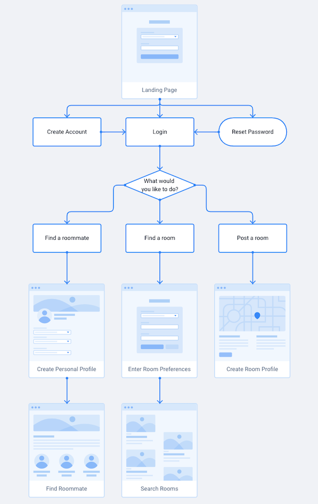

# RoomieFinderz
GA Project 3 Frontend with Thiago Garcia, Vi Nguyen, and Sameer Laul

<h2> Project Idea </h2>

This goal of this project is to allow users to use CRUD functionality and the MERN stack to improve the process of finding roommates and housing.

<h2>User Story</h2>

This app will create a platform for students on college campuses to:  
   • Find roommates  
   • Find rooms/sublets for rent 
   • Post rooms/sublets for rent 

Students can be matched with other students or rooms/sublets based on characteristics or preferences, such as: 
   • Age 
   • Gender 
   • Personality (introvert/extrovert, early/late riser, etc.) 
   
   • Housing style 
   • Number of rooms 
   • Number of bathrooms 
   • Price range 

<h2>Wireframe</h2>

